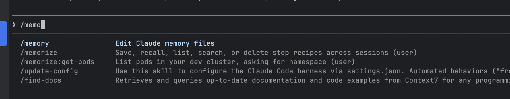

# claude-memorize

A Claude Code plugin that lets you save and replay operational recipes — exact steps you've performed successfully — so you never have to research them from scratch again.

## How it works

After Claude successfully completes a multi-step operation (e.g. syncing ArgoCD, pushing an ECR image, restarting a deployment), you can save those steps as a named recipe. Next time, recall the recipe by name and Claude executes the steps for you, prompting only for variable inputs.

The behavior rules are injected automatically via the plugin's `CLAUDE.md`, so Claude checks for matching recipes before researching any operational task from scratch, and suggests saving steps after success.

Save and recall operations are delegated to a **Claude Haiku** subagent — keeping costs low while the main model handles conversation and decision-making.

## Installation

```
/plugin marketplace add grinfeld/claude-memorize
/plugin install memorize@grinfeld
```

That's it. No shell scripts, no manual permission setup.

## Prerequisites

- [Claude Code](https://claude.ai/code) installed and configured

## Usage

### Save steps from the current conversation

After Claude has successfully completed something:

```
/memorize get-pods Store steps for getting pods in your dev cluster
```

Claude looks back through the conversation, extracts the steps that succeeded, generalizes hardcoded values into `<placeholders>`, and saves them as a recipe.

If you omit the description, Claude infers it from your last prompt:

```
/memorize get-pods
```

You can also ask in plain language:

> "memorize this as get-pods"
> "save what you just did into /memorize as get-pods"



### Recall and execute a saved recipe

```
/memorize sync_argocd
```

Claude reads the recipe, shows you the steps, asks for any `<placeholder>` values, then executes them.

Each saved recipe also registers as a subcommand for autocomplete:

```
/memorize:sync_argocd
/memorize:push_ecr_image
```

You can also reference recipes naturally in conversation:

> "sync argocd from memory"
> "do the ecr push thing we memorized"

### Other commands

```
/memorize list                    # show all saved recipes
/memorize search argocd k8s       # find recipes by keyword
/memorize delete sync_argocd      # delete a recipe (asks for confirmation)
```

### Full Example

My first request to claude

    ❯ Let me check ArgoCD sync status directly.
    ⏺ Let me get the current context and ArgoCD app status.
    ⏺ Bash(kubectl config current-context)
    ⎿  arn:aws:eks:us-east-1:123456789012:cluster/my-eks
    ⏺ Bash(kubectl --context arn:aws:eks:us-east-1:123456789012:cluster/my-eks get application something-wrong -n argocd -o jsonpath='{.status.sync.status}{"\n"}{.s…)
    ⎿  Error: Exit code 1
    error: the server doesn't have a resource type "application"
    ⏺ Bash(kubectl --context arn:aws:eks:us-east-1:123456789012:cluster/my-eks get applications.argoproj.io something-wrong -n argocd -o jsonpath='Sync: {.status.sy…)
    ⎿  Interrupted · What should Claude do instead?
    ❯ check argocd is synced for myargocd-app
    ⏺ Bash(kubectl --context arn:aws:eks:us-east-1:123456789012:cluster/my-eks get applications.argoproj.io myargocd-app -n argocd -o jsonpath='Sync: {.status.sy…)
    ⎿  Error: Exit code 1
    error: the server doesn't have a resource type "applications"
    ⏺ Bash(kubectl --context arn:aws:eks:us-east-1:123456789012:cluster/my-eks api-resources | grep argo)
    ⎿  No matches found
    ⏺ Bash(kubectl --context arn:aws:eks:us-east-1:123456789012:cluster/my-eks api-resources | grep -i application)
    ⎿  applicationnetworkpolicies          anp            networking.k8s.aws/v1alpha1               true         ApplicationNetworkPolicy
    ⏺ ArgoCD CRDs are not installed on this cluster. ArgoCD may be running on a different cluster, or it's not deployed here.

    Do you know which cluster ArgoCD is on? I can check available contexts with kubectl config get-contexts.

    ✻ Worked for 30s

    ❯ i know the profile argo-profile
    ⏺ Bash(kubectl config get-contexts | grep argo-profile)
      ⎿            argo-profile                                                 arn:aws:eks:us-east-1:09876543210:cluster/argo-profile      arn:aws:eks:us-east-1:09876543210:cluster/argo-profile
    ⏺ Bash(kubectl --context argo-profile get applications.argoproj.io myargocd-app -n argocd -o jsonpath='Sync: {.status.sync.status}{"\n"}Health: {.status.health.statu…)
      ⎿  Error: Exit code 1
         Error from server (NotFound): namespaces "argocd" not found
    ⏺ Bash(kubectl --context argo-profile get namespaces | grep -i argo)
      ⎿  argocd-dev     Active        85d
         argocd-in-prod        Terminating   85d
    ⏺ Bash(kubectl --context argo-profile get applications.argoproj.io myargocd-app -n argocd-dev -o jsonpath='Sync: {.status.sync.status}{"\n"}Health: {.status.heal…)
      ⎿  Error: Exit code 1
         Error from server (NotFound): applications.argoproj.io "myargocd-app" not found
    ⏺ Bash(kubectl --context argo-profile get applications.argoproj.io -n argocd-dev | grep -i data-factory)
      ⎿  data-myargocd-app                   Synced        Healthy
    ⏺ data-myargocd-app is Synced and Healthy.

    ✻ Churned for 46s

    ❯ memorize the action for checking dat-myargocd-app is synced
    ⏺ I'll memorize these steps using the memorize skill.
    ⏺ Skill(/memorize)
      ⎿  Successfully loaded skill
    ⏺ Let me read the index first, then save the recipe.
      Read 1 file (ctrl+o to expand)
      Read 1 file (ctrl+o to expand)
    ⏺ No existing recipe with that name. I'll delegate the write to a Haiku subagent.
    ⏺ Agent(Save ArgoCD recipe files) arn:aws:bedrock: us-east-1:09876543210:application-inference-profile/j6z4oxri7drp
      ⎿  Done (2 tool uses · 0 tokens · 6s)
      (ctrl+o to expand)
    ⏺ Agent(Save ArgoCD recipe files)
      ⎿  Done (7 tool uses · 7.6k tokens · 39s)
      (ctrl+o to expand)
    ⏺ Recipe argocd-check-myargocd-app saved. You can now run /memorize:argocd-check-myargocd-app to check the sync status directly.

    ✻ Cogitated for 1m 49s

My Second request to claude

    ❯ /memorize:argocd-check-myargocd-app
    ⏺ Let me fetch the tool schema and read the recipe in parallel.
      Read 1 file (ctrl+o to expand)
    ⏺ No placeholders needed. Executing the steps now.
    ⏺ Running the steps from the recipe.
    ⏺ Bash(kubectl --context my-context get applications.argoproj.io my-app -n argocd-xxxxx -o jsonpath='Sync: {.status.sync.status}{"\n"}Health: {.status…)
      ⎿  Sync: Synced
         Health: Healthy
    ⏺ my-app is in good shape:
      - Sync: Synced
      - Health: Healthy

## Recipe format

Each recipe is a plain Markdown file at `~/.claude/skills/memorize/recipes/<name>.md`:

```markdown
# sync_argocd

**Description**: Sync an ArgoCD application from the CLI
**Tags**: argocd, gitops, k8s
**Last updated**: 2026-03-24

## Steps

1. List applications: `kubectl --context shared-eks -n argocd-nonprod get applications`
2. Trigger sync: `argocd app sync <app-name>`
3. Wait for health: `argocd app wait <app-name> --health`

## Notes

- ArgoCD runs on shared-eks, namespace argocd-nonprod
- Credentials must already be configured via `argocd login`
```

You can edit recipe files directly — they're just Markdown.

## File layout after install

```
~/.claude/commands/memorize/
  sync_argocd.md             ← autocomplete subcommand (/memorize:sync_argocd)
  push_ecr_image.md          ← autocomplete subcommand (/memorize:push_ecr_image)
  ...                        ← auto-created on save, auto-deleted on delete

~/.claude/skills/memorize/
  index.md                   ← searchable recipe index
  recipes/
    sync_argocd.md
    push_ecr_image.md
    ...
```

The plugin itself lives in the Claude Code plugin cache and updates automatically.

## Updating

```
/plugin update memorize@grinfeld
```
